# Re:Invent 2019 Optimize ML training and inferencing using Amazon EC2 GPU Instances Lab

## Schedule:  ##
- CMP307-R	Mon	2019-12-02 16:45:00	MGM, Level 1, Boulevard Ballroom 156
- CMP307-R1	Tue	2019-12-03 19:00:00	[REPEAT 1] Aria, Plaza Level East, Orovada 8 
- CMP307-R2	Wed	2019-12-04 08:30:00	[REPEAT 2] Aria, Plaza Level East, Orovada 8


Amazon SageMaker is a fully-managed service that enables developers and data scientists to quickly and easily build, train, and deploy machine learning models at scale. Amazon EC2 P3 instances deliver the highest performance compute in the cloud, are cost-effective, support all major machine learning frameworks, and are available globally. In this workshop, you'll create a SageMaker notebook instance and work through sample Jupyter notebooks that demonstrate some of the many features of SageMaker and how Amazon [EC2 P3](https://aws.amazon.com/ec2/instance-types/p3/) is used to accelerate machine learning model training, and the new [G4 instances](https://aws.amazon.com/about-aws/whats-new/2019/09/introducing-amazon-ec2-g4-instances-the-most-cost-effective-gpu-platform/#:~:targetText=G4%20instances%20provide%20the%20latest,GB%20of%20local%20NVMe%20storage.) are used to optimize Deep Learning model inferences.    


## Optional Prerequisites

**Slides**   [Slides.](https://github.com/awshlabs/kdd2019/blob/master/slides/GTC-DC%20Build%2C%20Train%2C%20and%20Deploy%20Deep%20Learning%20Models%20Faster%20in%20the%20Cloud%20with%20Amazon%20SageMaker%20v0.5.pdf)  You may also find this on Re:Invent [website](https://reinvent.awsevents.com/). 

**Dive into Deep Learning** Book:  [http://d2l.ai/](http://d2l.ai/) 


### AWS Region

SageMaker is not available in all AWS Regions at this time.  Accordingly, we recommend running this workshop in one of the supported AWS Regions such as N. Virginia, **Oregon**, Ohio.  For this Lab, please use **Oregon**.

**Once you've chosen a region, you should create all of the resources for this workshop there, including a new Amazon S3 bucket and a new SageMaker notebook instance. Make sure you select your region from the dropdown in the upper right corner of the AWS Console before getting started.**

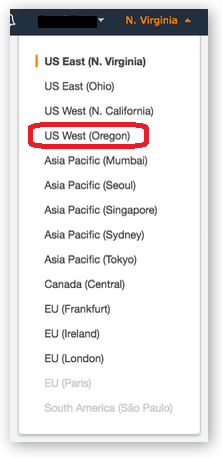


### Browser

We recommend you use the latest version of [Chrome](https://www.google.com/chrome/) or [Firefox](https://www.mozilla.org/en-US/firefox/new/) to complete this workshop.

## Modules

This workshop is divided into multiple modules. You can complete the other modules (Modules 2 and 3) in any order.  

1. **Creating a Notebook Instance (In Oregon).**
2. **Object Detection Using P3 and G4 Instances.**
3. **Running GluonNLP BERT Model.**
4. **Additional and optional Modules.**
	-  **Question Answering Bert.**
 	-  **Deploy Bert end-to-end.**

Be patient as you work your way through the notebook-based modules. After you run a cell in a notebook, it may take several seconds for the code to show results. For the cells that start training jobs, it may take 10 to 30 minutes. 

After you have completed the workshop, you can delete all of the resources that were created by following the Cleanup Guide provided with this lab guide. 

## Module 1:  Creating a Notebook Instance

In this module, we'll start by creating an Amazon S3 bucket that will be used throughout the workshop.  We'll then create a SageMaker notebook instance, which we will use to run the other workshop modules.

### 1. Create a S3 Bucket  (Make sure this is in the same region as SageMaker, **Oregon**).

SageMaker typically uses S3 as storage for data and model artifacts.  In this step you'll create a S3 bucket for this purpose. To begin, sign into the AWS Management Console, https://console.aws.amazon.com/.

#### High-Level Instructions

Use the console or AWS CLI to create an Amazon S3 bucket. Keep in mind that your bucket's name must be globally unique across all regions and customers. We recommend using a name like `p3workshop-firstname-lastname`. If you get an error that your bucket name already exists, try adding additional numbers or characters until you find an unused name.

<details>
<summary><strong>Step-by-step instructions (expand for details)</strong></summary><p>

1. In the AWS Management Console, choose **Services** then select **S3** under Storage.

1. Choose **+Create Bucket**

1. Provide a globally unique name for your bucket such as `smworkshop-firstname-lastname`.

1. Select the Region you've chosen to use for this workshop from the dropdown.

1. Choose **Create** in the lower left of the dialog without selecting a bucket to copy settings from.
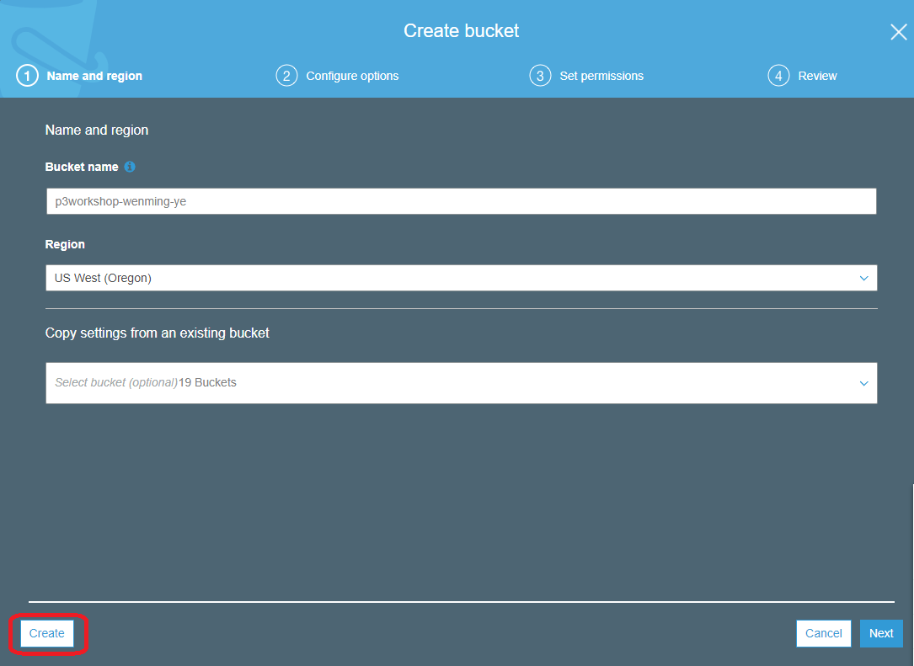
</p></details>

### 2. Launching the Notebook Instance  (**Pick Oregon**)

1. In the upper-right corner of the AWS Management Console, confirm you are in the desired AWS region.  **Oregon**.

2. Click on Amazon SageMaker from the list of all services.  This will bring you to the Amazon SageMaker console homepage.


3.To create a new notebook instance, go to **Notebook instances**, and click the **Create notebook instance** button at the top of the browser window.


4.Type [First Name]-[Last Name]-workshop into the **Notebook instance name** text box, and select **ml.p3.2xlarge** for the **Notebook instance type**. 

Make sure you enter **10 GB** under Additional Configuration pull down. On the same page, configure IAM role, choose **Create a new role**. 

On the next screen, select **Any S3 buckets** for the **S3 buckets you specify - optional** section.

Verify you entered **10** for the **Volume Size In GB ** instead of the default 5, the default will cause out of space error.

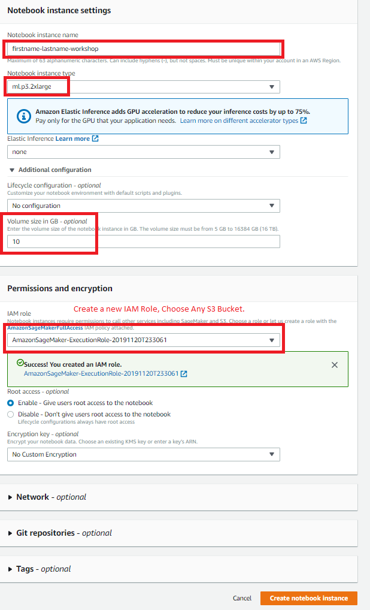

5.Click **Create notebook instance**.  This will take several minutes to complete.

### 3. Accessing the Notebook Instance

1. Wait for the server status to change to **InService**. This will take a few minutes.

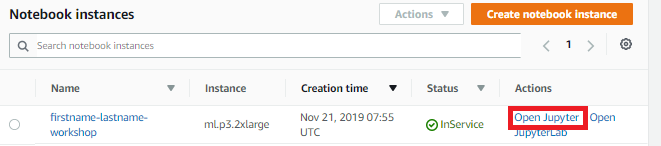

2. Click **Open Jupyter**. You will now see the Jupyter homepage for your notebook instance.


### 4. Download workshop content

1. On the top right corner of the Jupyter Notebook, select **Terminal** from **New** dropdown to open a terminal window.  We will use this terminal to download workshop content from github using git client.


2. Inside the terminal window, type the following commands to download the content. 
 + cd /home/ec2-user/SageMaker
 + git clone https://github.com/awshlabs/reinventGPULab

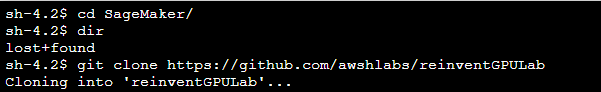

3. Switch back to the Jupyter notebook home tab, you will see a new folder called **reinventGPULab** showed up.

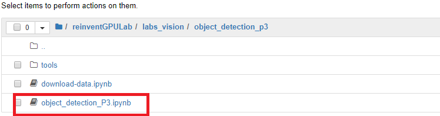


## Module 2:  Object Detection Using P3

This notebook is an end-to-end example introducing the Amazon SageMaker Object Detection algorithm. In this demo, we will demonstrate how to train and to host an object detection model using the Single Shot multibox Detector ([SSD](https://arxiv.org/abs/1512.02325)) algorithm. In doing so, we will also demonstrate how to construct a training dataset using the RecordIO format as this is the format that the training job will consume. We will also demonstrate how to host and validate this trained model.


1. Open the **reinventGPULab** folder, followed by **labs_vision** folder, and then the **object_detection_p3** folder in your Jupyter to display a list of Jupyter notebooks.
1. Click on **Object-detection-P3.ipynb** to open the notebook.
1. Follow the instructions in the notebook to continue with the lab.
1. Make sure you enter your bucket name correctly under Setup.

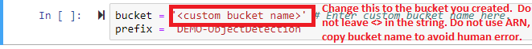
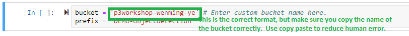
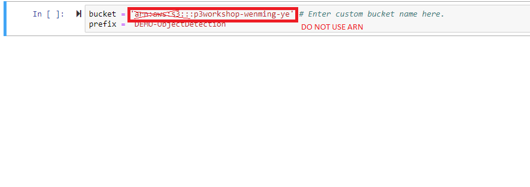
 **NOTE: Getting the dataset takes about 10 min, training the model for this example typically takes about 15 minutes, setting up an inference end point takes about 5 min.**

**Code Highlights**

SageMaker Estimator makes remote distributed training convenient.

```python
od_model = sagemaker.estimator.Estimator(training_image,                        //docker image
                                         role, 
                                         train_instance_count=1, 
                                         train_instance_type='ml.p3.2xlarge',   // instance Type, p2, p3 typically.
                                         train_volume_size = 50,
                                         train_max_run = 360000,                // 100 hours
                                         input_mode= 'File',
                                         output_path=s3_output_location,
                                         sagemaker_session=sess)
```

Setting up Hyperparameters.

```python
od_model.set_hyperparameters(base_network='resnet-50',  // base network, example, mobilenet, resnet, alexnet, vgg16, inception, etc.
                             num_classes=20,     // number of objects to classify
                             mini_batch_size=16, // number of samples to work through before updating the internal model parameters
                             epochs=1,           // number of passes of the entire training dataset
                             learning_rate=0.001,
                             optimizer='sgd',    //Stochastic Gradient Descent
                             momentum=0.9,
                             weight_decay=0.0005,
                             overlap_threshold=0.5,
                             nms_threshold=0.45,
                             image_shape=512,
                             label_width=350,
                             num_training_samples=16551)
```                        

**NOTE: As soon as the model training starts, please start Module number 3 and come back to this. The model training will take about 10 minutes.**

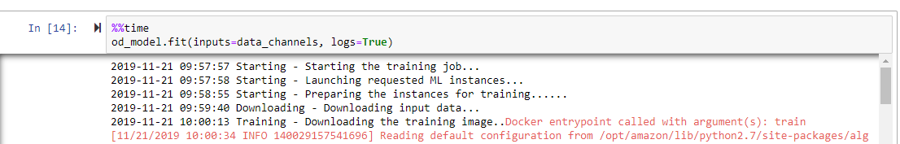

When the Lab is completed, you should be able to see a test Image with object bounding boxes.

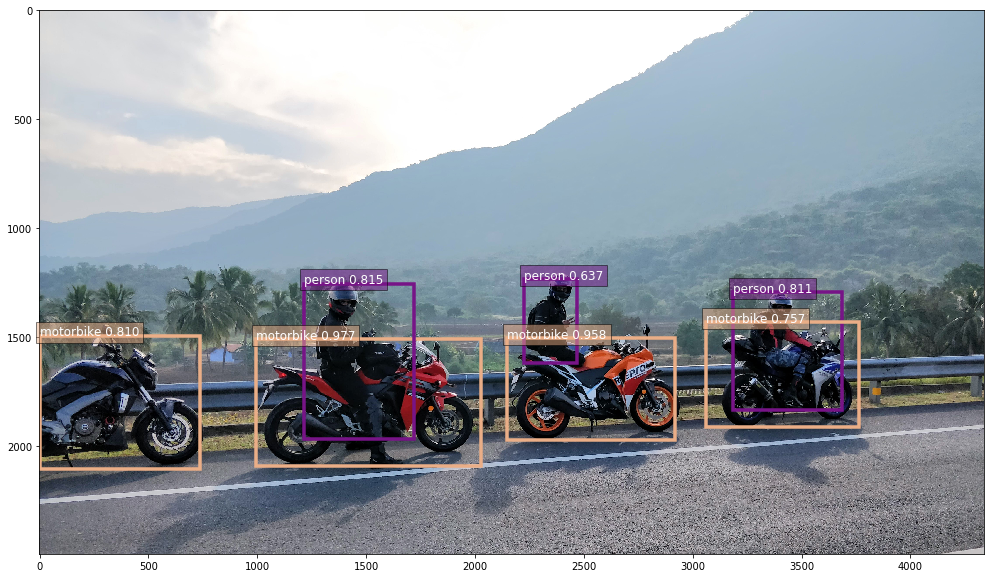


## Module 3: GluonNLP BERT Lab
1. Check out a copy of the Gluon Tutorial.  
 + cd /home/ec2-user/SageMaker
 + git clone https://github.com/astonzhang/KDD19-tutorial
 
2. Open Jupyter Notebook and navigate to 07_bert_app/ directory, Open the bert.ipynb.
3. Pick the conda_mxnet_p36 kernel.

4. At the top of the notebook add a cell by using the + tool symbol. 
add the following lines in the cell:

```
!pip install d2l==0.8.2
!pip install gluonNLP
```

 Shift+Enter to run the cell.  
 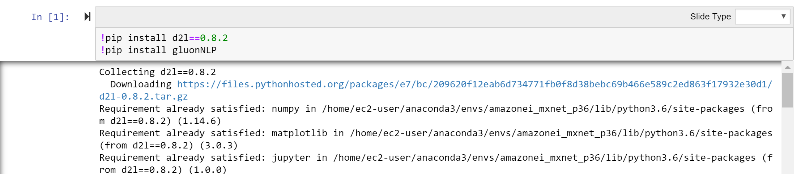
 
5.Continue running the notebook until the training starts.

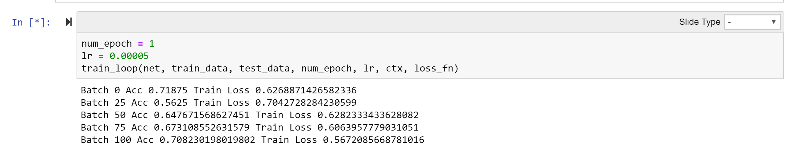
 
6.As the training starts, optionally go into the terminal window and type the command:
 
``` 
	watch nvidia-smi. 
```

7.Monitor GPU utilization.

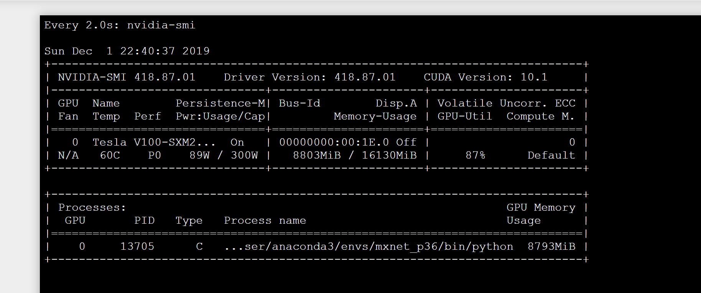 


8.Testing the trained model.

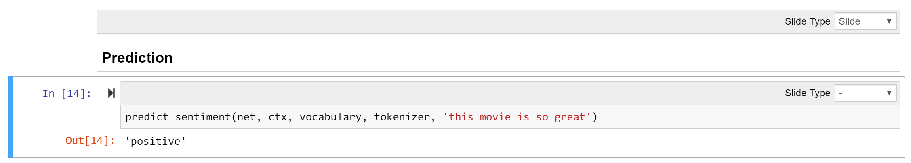

 
## Additional (Optional) NLP Module:  
 1. BERT Q&A Model: Github [https://github.com/eric-haibin-lin/nlp-notebooks/tree/master/natural_language_understanding ](https://github.com/eric-haibin-lin/nlp-notebooks/tree/master/natural_language_understanding)  Run: question_answering.ipynb
 2. Hands-on: Training and deploying GluonNLP models on AWS SageMaker Github: [https://github.com/eric-haibin-lin/reinvent19-gluonnlp/blob/master/tutorial/](https://github.com/eric-haibin-lin/reinvent19-gluonnlp/blob/master/tutorial/) Run: train_deploy_bert.ipynb

## Additional (Optional) Container Models: 
 1. Amazon Elastic Container Service (Amazon ECS) tutorial.
    https://aws.amazon.com/getting-started/tutorials/train-deep-learning-model-aws-ec2-containers/
 
 2. Amazon Elastic Kubernetes Service (EKS) tutorial.
    https://docs.aws.amazon.com/dlami/latest/devguide/deep-learning-containers-eks.html


### AWS Account (Free credit you are receiving for use after the workshop).

In order to complete this workshop you'll need an AWS Account with access to create AWS IAM, S3, and SageMaker resources. If you do not have an AWS Account, please follow the [instructions here](https://aws.amazon.com/premiumsupport/knowledge-center/create-and-activate-aws-account/) to create an AWS Account. 

The code and instructions in this workshop assume only one student is using a given AWS account at a time. If you try sharing an account with another student, you'll run into naming conflicts for certain resources. You can work around these by appending a unique suffix to the resources that fail to create due to conflicts, but the instructions do not provide details on the changes required to make this work.

If you are provided with AWS credit for this workshop, use this [link](https://console.aws.amazon.com/billing/home?#/credits) to apply the credit to your AWS Account.


## Cleanup Guide   **Do the cleaning up after all labs are done**

**To avoid charges** for resources you no longer need when you're done with this workshop, you can delete them or, in the case of your notebook instance, stop them. This is especially important if you are doing this at home or using the free credit provided after the workshop. Here are the resources you should consider:

- Endpoints:  these are the clusters of one or more instances serving inferences from your models. If you did not delete them from within the notebooks, you can delete them via the SageMaker console.  To do so, click the **Endpoints** link in the left panel.  Then, for each endpoint, click the radio button next to it, then select **Delete** from the **Actions** drop down menu. You can follow a similar procedure to delete the related Models and Endpoint configurations.

- Notebook instance:  you have two options if you do not want to keep the notebook instance running. If you would like to save it for later, you can stop rather than deleting it. To delete it, click the **Notebook instances** link in the left panel. Next, click the radio button next to the notebook instance created for this workshop, then select **Delete** from the **Actions** drop down menu. To simply stop it instead, just click the **Stop** link.  After it is stopped, you can start it again by clicking the **Start** link.  Keep in mind that if you stop rather than deleting it, you will be charged for the storage associated with it.  


## License

The contents of this workshop are licensed under the Apache 2.0 License. 
